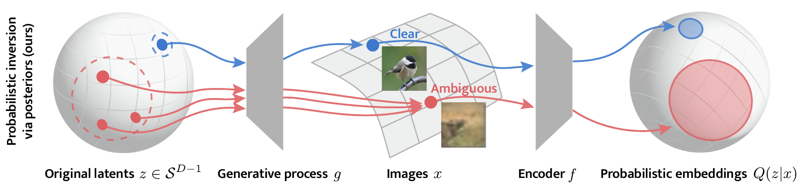

# Probabilistic Contrastive Learning Recovers the Correct Aleatoric Uncertainty of Ambiguous Inputs

Michael Kirchhof, Enkelejda Kasneci, Seong Joon Oh

---



_Contrastively trained encoders have recently been proven to invert the data-generating process: they encode each input, e.g., an image, into the true latent vector that generated the image (Zimmermann et al., 2021). However, real-world observations often have inherent ambiguities. For instance, images may be blurred or only show a 2D view of a 3D object, so multiple latents could have generated them. This makes the true posterior for the latent vector probabilistic with heteroscedastic uncertainty. In this setup, we extend the common InfoNCE objective and encoders to predict latent distributions instead of points. We prove that these distributions recover the correct posteriors of the data-generating process, including its level of aleatoric uncertainty, up to a rotation of the latent space. In addition to providing calibrated uncertainty estimates, these posteriors allow the computation of credible intervals in image retrieval. They comprise images with the same latent as a given query, subject to its uncertainty._

**Link**: https://arxiv.org/abs/2302.02865

---
### Installation
This code was tested on Python 3.8. Use the code below to create a fitting conda environment.

```commandline
conda create --name probcontrlearning python=3.8
conda install pytorch torchvision torchaudio pytorch-cuda=11.7 -c pytorch -c nvidia
conda install tqdm scipy matplotlib argparse
pip install wandb tueplots
```

If you want to do experiments on CIFAR-10H, you need to download the pretrained ResNet18 and the CIFAR-10H labels. [Download the ResNet weights](https://drive.google.com/file/d/17fmN8eQdLpq2jIMQ_X0IXDPXfI9oVWgq/view?usp=sharing), unzip and copy them into `models/state_dicts/resnet18.pt`. Then, [download the CIFAR-10H labels](https://github.com/jcpeterson/cifar-10h/blob/master/data/cifar10h-probs.npy) and copy them into `data/cifar10h-probs.npy`. The CIFAR-10 data itself is downloaded automatically.

---
### Reproducing Paper Results

The `experiment_scripts` folder contains all shell files to reproduce our results. Here's an example:
```
python main.py --loss MCInfoNCE --g_dim_z 10 --g_dim_x 10 --e_dim_z 10 \
--g_pos_kappa 20 --g_post_kappa_min 16 --g_post_kappa_max 32 \
--n_phases 1 --n_batches_per_half_phase 50000 --bs 512 \
--l_n_samples 512 --n_neg 32 --use_wandb False --seed 4
```
These flags mean the following (`parameters.py` contains descriptions of all parameters):

* `main.py` is used to train encoders in the controlled experiments. `main_cifar.py` trains and tests encoders on the CIFAR experiment.
* `--loss` is by default `MCInfoNCE`. We also provide implementations for Expected Likelihood Kernels `ELK` and `HedgedInstance` embeddings. 
* `--g_dim_z`, `--g_dim_x`, and `--e_dim_z` control the dimensions of the latent space of the generative process, the image space, and the latent space of the encoder, respectively.
* `--g_pos_kappa` controls $\kappa_\text{pos}$, i.e., how close latents have to be in the generative latent space to be considered positive samples to one another.
* `--g_post_kappa_min` and `--g_post_kappa_max` control the in which range the true posterior kappas should lie (higher=less ambiguous; `"Inf"` to remove the uncertainty).
* `--n_phases` controls how many phases we want in our training. Each phase first trains $\hat{\mu}(x)$ for `--n_batches_per_half_phase` batches of size `--bs` and then $\hat{\kappa}(x)$. If you want to train $\hat{\mu}(x)$ and $\hat{\kappa}(x)$ simultaneously, set `--n_phases 0`.
* `--l_n_samples` is the number of MC samples to calculate the MCInfoNCE loss.
* `--n_neg` is the number of negative contrastive samples per positive pair. Use `--n_neg 0` to use rolled samples from the own batch as negative samples.
* `--use_wandb` is a boolean flag on whether to use wandb or store results in a local `/results` folder. If you want to use wandb, enter your API key with `--wandb_key`.
* `--seed` The random seed that controls the intitialization of the generative process. We used seeds `1, 2, 3` for development and hyperparameter tuning and `4, 5, 6, 7, 8` for the paper results.

---

### Applying MCInfoNCE to Your Own Problem

If you want obtain probabilistic embeddings for your own contrastive learning problem, you need two things:

1) Copy-paste the `MCInfoNCE()` loss from `utils/losses.py` into your project. The most important hyperparameters to tune are `kappa_init` and `n_neg`. We found `16` to be a solid starting value for both.
2) Make your encoder output both
   1) mean (your typical penultimate-layer embedding, normalized to an $L_2$ norm of 1) and 
   2) kappa (scalar value indicating the certainty). 

   You can use an explicit network to predict kappa, as for example in `models/encoder.py`, but you can also implicitly parameterize it via the norm of your embedding, as in `models/encoder_resnet.py`. The latter has been confirmed to work plug-and-play with ResNet and VGG architectures. We'd be happy to learn whether it also works on yours.

---

### How to Cite:
```
@article{kirchhof2023probabilistic,
  author={Kirchhof, Michael and Kasneci, Enkelejda and Oh, Seong Joon},
  title={Probabilistic Contrastive Learning Recovers the Correct Aleatoric Uncertainty of Ambiguous Inputs},
  journal={arXiv preprint arXiv:2302.02865},
  year={2023}
}
```